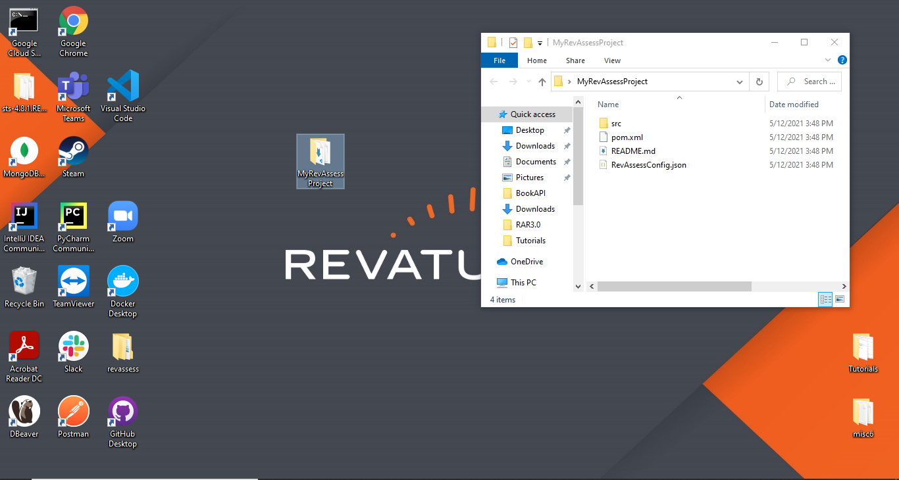

# What is RevAssess?
RevAssess is a platform to assign software **exercises** to associates. An exercise is a self-contained software project.

## Is an exercise a coding challenge?
A RevAssess exercise is not a typical coding challenge. A coding challenge might ask you to implement a few methods or create a data structure.
Exercises require you to implement portions of actual software projects. 

### Examples
- Create a REST API for a specific entity
- Implement a DAO interface
- Debug and fix a broken service class

## DO's and DON'Ts
- *DO* use your notes, past code or Google for problems you run into. RevAssess is an open book asssesment. 
- *DO* reach out to your trainer if you have a technial issue with RevAssess. For example, project.zip will not download.
- *DO* use your own cloud resources like SQL databases, S3 etc... Being a software developer involves knowing how to commission and use all your tools.
- *DO* use whatever software will help you achieve the task. I.E. if you need to add a dependency or test via Postman.
---
- *DON'T* store sensitive information in your code. (Use environment variables or configuration files outside the project)
- *DON'T* remove/edit the RevAssessConfig.json or TestResults.json files 
- *DON'T* ask each other or your trainer for help. The goal is to test your ability to independently problem solve.

## Taking a RevAssesss

1. Go to the following link https://revassess.web.app/registration .
2. Put in the exercise ID provided by your trainer.
3. Fillout your name and email.

4. Press commence and a project.zip file should begin downloading.

    - If it does not begin downloading or it looks like it is hanging, disable your ad blocker and allow popups.
    - Refresh the page and resubmit the form.
5. Unzip that folder anywhere on your computer. 

6. Once extracted delete the project.zip.

7. Import your project into your preferred IDE 
    - Eclipse is shown but you can use any IDE you want.
8. Read the prompt provided by the readme.md provided in the project. This will explain the exercise.
9. Write your code as you normally would in your IDE.

10. Whenever you run a test, your code and test results will be automatically sent to the trainer. 

